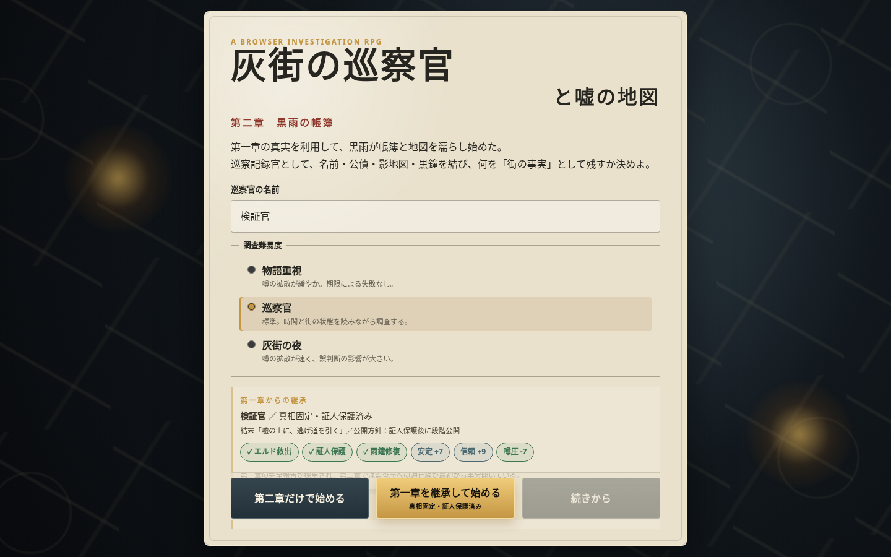

# 灰街の巡察官と嘘の地図 — 第一部完結版

雨と煤に沈む都市「灰街」を巡察し、失踪事件と改ざんされた記録の真相を追うブラウザ推理RPGです。

第一章の選択・証拠・正式報告は第二章へ継承され、評議会中枢での最終推理、噂戦、終局報告、分岐エピローグまで一続きで遊べます。

## 今すぐプレイ

### [GitHub Pagesでゲームを始める](https://hiroshitanaka-creator.github.io/-/)

PCとiPhoneのSafariに対応しています。インストールやアカウント登録は不要です。



## ゲームの特徴

- 第一章「雨鐘の失踪者」から第二章・完結編「黒雨の帳簿と白紙選挙」まで収録
- 第一章での判断、証人保護、公開方針、正式報告を第二章へ継承
- 探索、証拠収集、推理、戦闘、噂戦を組み合わせた物語進行
- 終局報告の内容に応じて変化する分岐エピローグ
- iPhone向けタッチUI、レスポンシブ表示、ホーム画面起動に対応
- Service Workerによるオフラインキャッシュ対応
- サーバーやデータベースを使わないHTML / CSS / JavaScript製PWA

## あらすじ

地図から人が消え、帳簿から名前が消え、街の「公認記録」が真実を塗り替えていく灰街。

プレイヤーは巡察官として失踪事件を追いながら、白紙選挙と黒雨帳簿の仕組みに迫ります。何を記録し、誰を守り、どの真実を街へ残すか。その判断が第二章の状況と最後の報告を変えます。

## 推奨プレイ順

1. ランチャーで「第一章から始める」を選ぶ
2. 第一章を調査し、正式報告を提出する
3. 結末画面から「第二章へ進む」を選ぶ
4. 継承された記録を章間ブリーフィングで確認する
5. 第二章の調査、最終推理、噂戦、終局報告を進める
6. 分岐エピローグで第一部の結末を確認する

第二章から単独で開始することもできますが、物語と変化を十分に体験するには第一章からの通しプレイを推奨します。

## iPhoneで遊ぶ

1. Safariで[公開ページ](https://hiroshitanaka-creator.github.io/-/)を開く
2. Safariの共有ボタンを押す
3. 「ホーム画面に追加」を選ぶ
4. ホーム画面の「灰街 完結版」から起動する

初回は通信環境のある状態で最後までページを読み込んでください。キャッシュ完了後は、対応済みの画面をオフラインでも起動できます。

`file://` で直接HTMLを開いた場合は、PWA、Service Worker、セーブ継承が正常に動かないことがあります。GitHub Pages版を利用してください。

## セーブと章間継承

進行状況と継承データはブラウザ内に保存されます。

- 同じ端末・同じSafari・同じ公開URLで続けると自動継承しやすくなります
- Safariの履歴・Webサイトデータを消去すると、保存内容が失われる場合があります
- 自動継承できない場合は、第一章で継承JSONを書き出し、第二章で手動読み込みしてください
- 別端末へ移る場合もJSONの書き出し／読み込みを使用してください

## 明るさについて

GitHub Pages公開版には、暗所での視認性を改善する明るさ調整パッチを適用しています。変更内容は [`BRIGHTNESS_PATCH_GUIDE.md`](BRIGHTNESS_PATCH_GUIDE.md) を参照してください。

## ローカルで起動する

PWAとセーブ機能を確認する場合は、リポジトリのルートをHTTPで配信します。

```bash
python3 -m http.server 8080
```

ブラウザで <http://localhost:8080/> を開いてください。

## 主な構成

| パス | 内容 |
|---|---|
| `index.html` | 第一部完結版ランチャー |
| `haimachi_chapter1_transfer/` | 第一章と継承データ出力 |
| `haimachi_chapter2_inheritance/` | 第二章・完結編と継承データ読込 |
| `manifest.webmanifest` | PWA設定 |
| `sw.js` / `offline.html` | オフライン起動 |
| `previews_through/` | 通し版の画面プレビュー |
| `BRIGHTNESS_PATCH_GUIDE.md` | 明るさ改善パッチの仕様 |

詳細資料：

- [`README_SEASON1_COMPLETE.md`](README_SEASON1_COMPLETE.md) — 第一部完結版の構造
- [`README_THROUGH_EXPERIENCE.md`](README_THROUGH_EXPERIENCE.md) — 章をまたぐ体験設計
- [`README_iPhone_PWA_SERIES.md`](README_iPhone_PWA_SERIES.md) — iPhone / PWA利用手順
- [`QA_SEASON1_COMPLETE.md`](QA_SEASON1_COMPLETE.md) — Season 1完結版の検証記録

## シリーズ展開

第一部は本作で完結します。エピローグには外街と別時間軸につながる余地を残しており、続編Season 2「灰街の巡察官と借りられた明日 — 外街篇『逆さ暦の債務者』」を別ビルドとして開発しています。

## ライセンス

このリポジトリのライセンスは [`LICENSE`](LICENSE) を参照してください。
