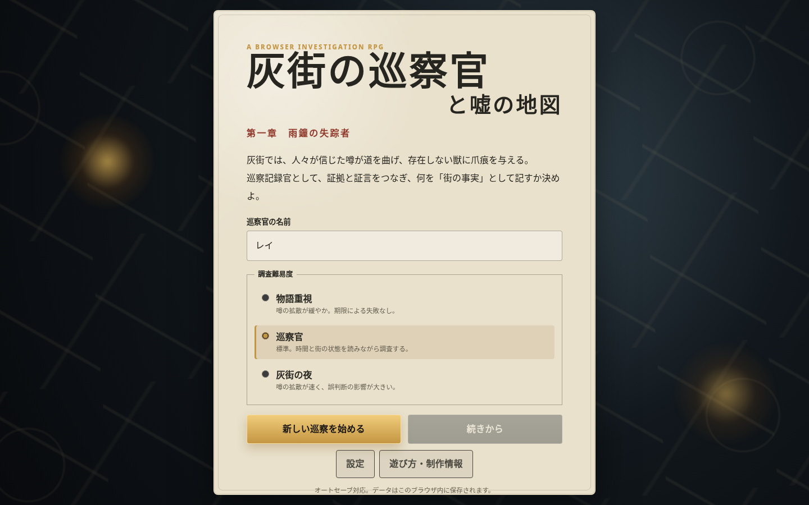
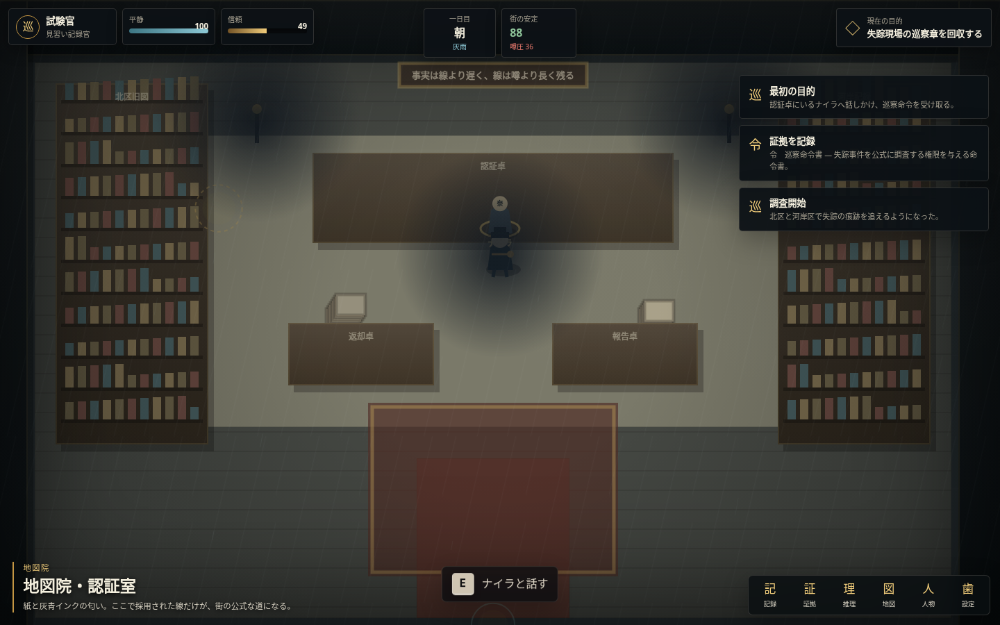
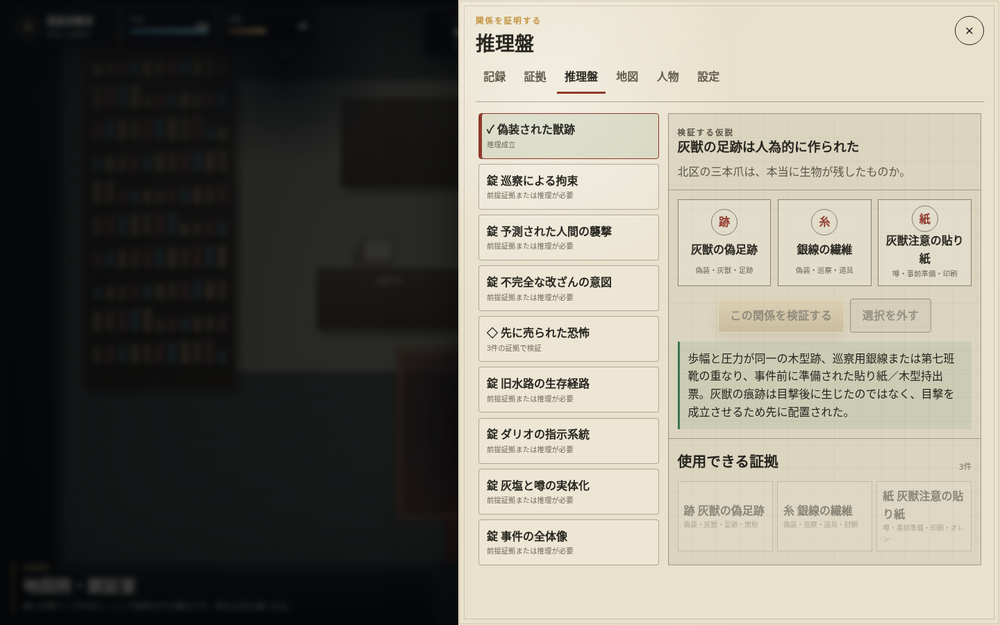
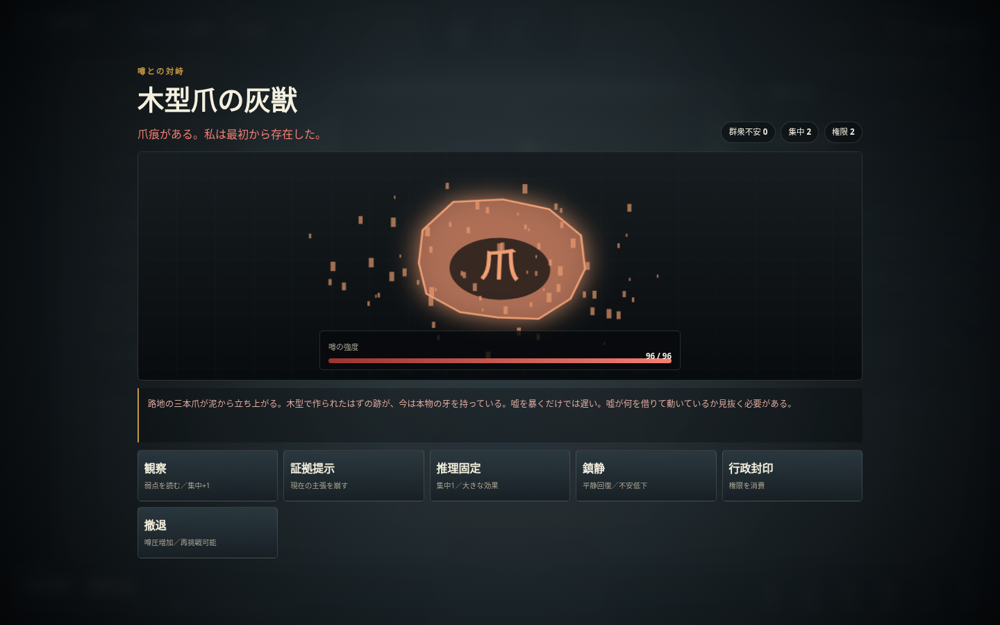

# 灰街の巡察官と嘘の地図

## 第一章「雨鐘の失踪者」

噂が現実を歪める都市を歩き、証拠・証言・人間関係を組み合わせて事件を解く、探索型ブラウザRPGです。

これは数分で終わる操作確認用デモではなく、導入から調査、推理、噂との対峙、正式報告、複数結末までを一つにつないだ**第一章プレイアブル版**です。



## ゲームの核

プレイヤーは灰街の巡察記録官となり、次の循環を繰り返します。

```text
街を歩く
→ 現場を調査し、証拠を得る
→ NPCから証言・嘘・沈黙の理由を引き出す
→ 推理盤で異なる論理役割の証拠を接続する
→ 噂が実体化した敵と「論証戦」を行う
→ 街の安定・信頼・地区状態を変える
→ 最後に、何を公式記録として残すか決める
```

単に正解を当てるだけではありません。真相へ到達しても、公開方法を誤れば証人が危険にさらされ、街が崩壊します。逆に、秩序を守るため真実を封印すれば、事件の根は残ります。

## 実装済みコンテンツ

- 探索区域：6
- 主要NPC：12
- 証拠：32
- 成立可能な推理：9
- 任務：6
- 噂との対峙：5
- 正式報告の組み合わせ：原因4 × 責任主体4 × 公開方針4
- 主要結末：8
- 難易度：3
- PCキーボード操作
- スマートフォン用仮想スティックと調査ボタン
- オートセーブ、手動セーブ、JSON書き出し・読み込み
- 表示・音量・高コントラスト・文字拡大・動きを減らす設定
- 将来のMCP接続を想定した読み取りResourceと候補Proposal境界



## 起動方法

### 方法1：単一HTML版を開く

`dist/haimachi_chapter1_standalone.html` をダブルクリックしてください。

CSSとJavaScriptをすべて一つのHTMLへ内包しているため、サーバーやインストールは不要です。

### 方法2：付属ランチャーを使う

#### Windows

`start_windows.bat` をダブルクリックします。

#### macOS / Linux

```bash
chmod +x start_mac_linux.sh
./start_mac_linux.sh
```

ブラウザが開かない場合は、次を開いてください。

```text
http://127.0.0.1:8080/
```

### 方法3：Pythonの標準サーバーを使う

```bash
python3 start_server.py
```

ポートを変える場合：

```bash
python3 start_server.py --port 9000
```

外部ライブラリ、npm、ビルドツールは不要です。

## 操作方法

| 操作 | PC | スマートフォン |
|---|---|---|
| 移動 | WASD / 矢印キー | 仮想スティック |
| 会話・調査・地区移動 | E / Space / Enter | 「調」ボタン |
| 巡察記録 | J | 下部の「記」 |
| 証拠台帳 | V | 下部の「証」 |
| 推理盤 | B | 下部の「理」 |
| 地図 | M | 下部の「図」 |
| 人物台帳 | P | 下部の「人」 |
| 閉じる | Esc | ×ボタン／背景タップ |
| デバッグ表示 | F3 | なし |

## 推理盤



推理は「証拠を一定数集めれば自動的に正解」ではありません。

各推理には複数の論理スロットがあります。たとえば、偽装を証明するには次のような別種の材料が必要です。

1. 現場の物理的異常
2. 人為的加工を示す痕跡
3. 事件前から準備されていたことを示す資料

物証だけ、証言だけ、容疑者への疑いだけでは成立しません。誤った組み合わせには、設定画面でヒント表示を有効にしている場合、欠けている論理役割が示されます。

## 噂との対峙



戦闘は通常のHP削りではなく、街で実体化した噂の主張を崩す**論証戦**です。

- 観察：現在の主張と弱点を読む
- 証拠提示：論点に合う物証・証言で噂の強度を下げる
- 推理提示：成立済みの因果関係をぶつける
- 鎮静：群衆不安を抑え、平静を立て直す
- 行政封印：権限を消費し、条件を満たした噂を固定・隔離する

同じ証拠を繰り返すと効果が急減します。噂は段階ごとに主張を変えるため、観察して論点を切り替える必要があります。

## 物語構造

第一章では、行商人エルドの失踪と「北区の灰獣」の噂を追います。

調査は次の五層で深まります。

```text
灰獣の足跡は偽装されている
→ エルドは巡察隊に違法拘束された
→ 灰獣の噂は事件前から準備されていた
→ 灰塩が反復された噂へ物理的な形を与える
→ 違法採掘と鎮圧実績が利益循環を作っていた
```

途中の一層だけで正式報告を出すこともできます。ただし、早合点は冤罪、証拠隠滅、噂災害の拡大につながります。

## セーブ

- オートセーブ：調査・移動・会話・戦闘などの節目
- 手動セーブ：設定画面
- 書き出し：JSON形式
- 読み込み：書き出したJSONから復元

ブラウザ内セーブには `localStorage` を使います。ブラウザのサイトデータを削除すると失われるため、長期保存ではJSON書き出しを使ってください。

## 技術構成

```text
index.html
css/
  theme.css
  layout.css
  components.css
  responsive.css
js/
  core/       状態生成、保存、入力、音、条件判定
  data/       地図、NPC、証拠、会話、推理、任務、敵、物語、結末
  systems/    時間、世界、移動、調査、会話、推理、戦闘、成長、MCP境界
  render/     Canvas上の街と戦闘描画
  ui/         DOM上のHUD、台帳、推理盤、会話、報告、スマホ操作
```

正式なゲーム状態はレンダラーやUIではなく、シリアライズ可能なJavaScript状態として保持しています。Canvasは世界を描画し、DOMは文字量の多い台帳・会話・推理・設定を担当します。

詳しくは次を参照してください。

- `docs/GAME_DESIGN.md`
- `docs/ARCHITECTURE.md`
- `docs/MCP_EXTENSION.md`
- `docs/QA_REPORT.md`

## MCP拡張境界

ブラウザのコンソールまたは将来のMCPブリッジから、次の読み取り専用境界を確認できます。

```javascript
window.haimachiMCP.getResourceSnapshot();
window.haimachiMCP.describeTools();
```

候補提案：

```javascript
window.haimachiMCP.submitProposal({
  type: "npc_memory_append",
  npcId: "mirei",
  text: "巡察官は証人保護を優先した"
});
```

この提案は候補キューへ入るだけで、正式なゲーム状態を直接変更しません。`state_patch` や任意パス書き換えは拒否されます。

## 現在の範囲と制約

- 本作は**第一章として開始から結末まで遊べる実装**です。複数章を含む長編全体は未実装です。
- 画面表現はCanvasとCSSによる手続き描画です。外部の画像・音声アセットには依存していません。
- NPC会話、事件、推理、敵は手作業で設計した固定コンテンツです。現時点で生成AIやMCPがなくても全機能が成立します。
- 長編化では、追加事件の品質維持、状態組み合わせの爆発、セーブ移行、スマートフォンのメモリ使用量が主要リスクです。

## 開発者向け検証

JavaScript構文検査：

```bash
find js -name '*.js' -print0 | xargs -0 -n1 node --check
```

データ参照整合性：

```bash
node tests/validate-data.js
```

単一HTML再生成：

```bash
python3 tools/build_standalone.py
```

## 第二章への継承データ

第一章の正式報告後、結末画面または設定画面から「第二章への継承データ」を書き出せます。
このJSONは第一章の内部状態を丸ごと移植するものではなく、第二章の初期条件に必要な以下だけを安全に要約します。

- 結末IDと結末名
- 正式報告の原因・責任主体・公開方針
- エルド救出、証人保護、雨鐘修復
- 主要推理の成立数、証拠数
- 街の安定度、市民信頼、噂圧
- 一部NPC信頼値

第二章はこの要約を読み、初期NPC信頼・噂圧・派閥姿勢・地区状態へ反映します。詳しくは `docs/CHAPTER2_TRANSFER.md` を参照してください。
